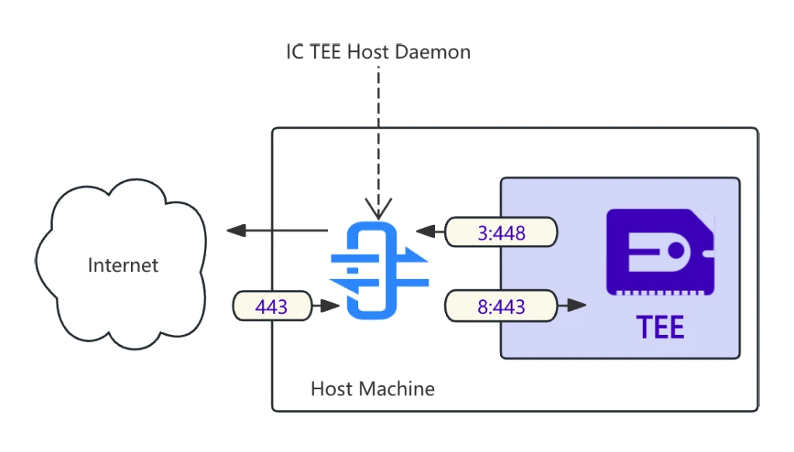

# IC TEE Host Daemon

`ic_tee_host_daemon` is a daemon running on the host machine of an enclave, providing the following functions:

1. Forwards requests from the enclave to the internet (e.g. options: --outbound-vsock-addr 3:1200).
2. Listens for requests from the internet and forwards them to the enclave (e.g. options: --inbound-vsock-addr 88:443 --inbound-listen-addr 0.0.0.0:443).
3. Receives logs from the enclave and outputs them to stdout (e.g. options: --logtail-addr 127.0.0.1:9999).



## Usage
```bash
sudo ./ic_tee_host_daemon --outbound-vsock-addr 3:1200 --inbound-vsock-addr 88:443 --inbound-listen-addr 0.0.0.0:443 --logtail-addr 127.0.0.1:9999
```

or with default values:
```bash
sudo ./ic_tee_host_daemon
```

## License
Copyright © 2024 [LDC Labs](https://github.com/ldclabs).

`ldclabs/ic-tee-host-daemon` is licensed under the MIT License. See [LICENSE](./LICENSE) for the full license text.